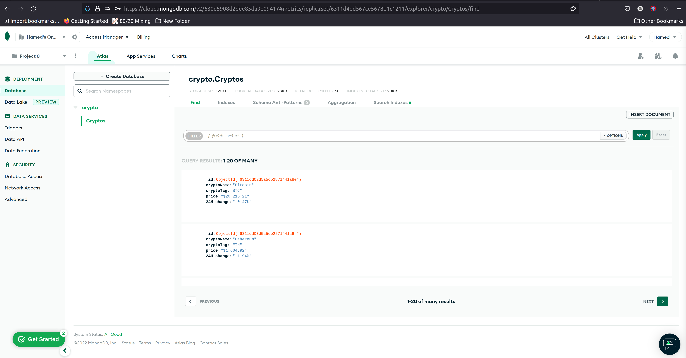

# Celery-Crypto-Scraper with Automathic Mongodb Storage
<h4>
This app scrape the top 50s crypto information into a json file every <b><u>6 seconds</u></b> using a scrapy spider, redis & celery beat.</h4>  

<h4> I wrote a scrapy pipline witch able to store the infomraion into a cluster in mongodb atlas service and we can intergarte with that with any application we want <h4>

  
  
  
  
